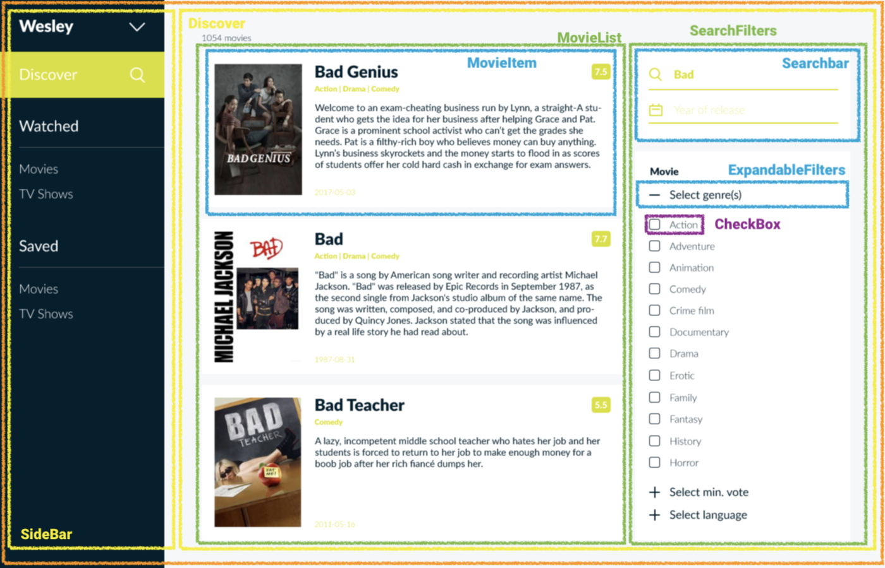
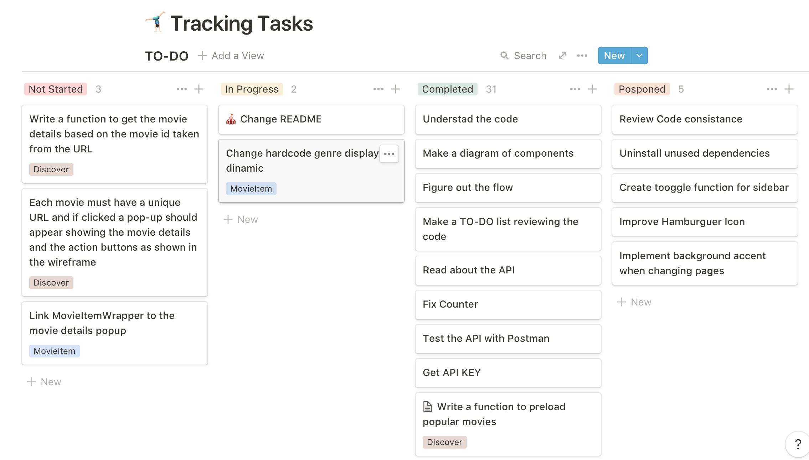
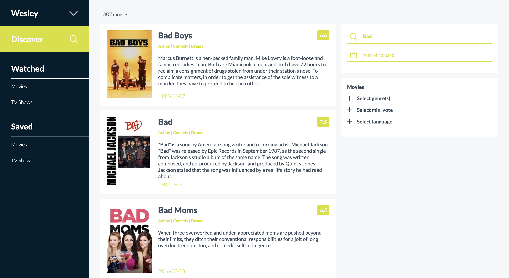
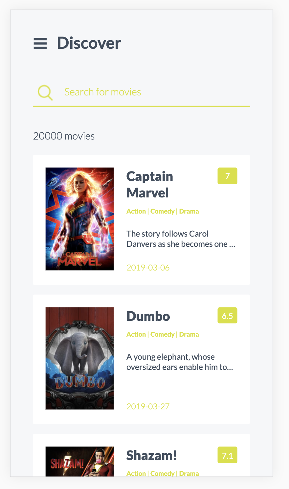

This is my solution for the FrontEnd challange proposed by Co-Hire. In this document,you can find information about the the proccess.

# The Challenge

[cohire/frontend-challenge](https://github.com/cohire/frontend-challenge)

# 🤸🏻‍♂️ Tracking Tasks

[To-do](https://www.notion.so/123d85918a224cdc9378eb8919ea48ca)

# ⚙️ The Process

One of the first thing to do was to understand the code provided and make a diagram based on the components and mockups.

Also was important to define the tasks and things to do and track them during the process, in the next picture you can see how my board ended up after almost finishing everything. The completed column is quite long and is not completely displayed.

The rest of the process can be understood from the different commits submitted. But was mainly focus on tackle the search function at the beginning (despite design is 50%) because with that function implemented I would have been styling a static page.

# ⏲ Things to implement/fix/improve

The exercise has been made along different days and with limited time, I have been trying to prioritise the functionality. However, I am aware that different things could be implemented better and some code needs to be reviewed and refactored. Here is a list of things to take into account:

- Find a better and cleaner solution for SearchBar code
- Fix text in overflow for movieItem with a better solution like the fade effect in the designs
- Find better icons (more similar to design )for + and - in expandableFilters and put animations on them
- Find better hamburger icon
- Make SideBar accent dynamic when the page changes
- Use toggle function for sideBar instead close/open
- Set state of Expandable components based on prop to allowing to customize default state
- Finish vote ids and names
- Change all bindings for experimental syntax of babel
- Use infinite load for movies
- Hiding the APIkey in a environment variable
- Improve animations and transitions
- Normalize browsers
- Make it a progressive app
- **Complete the Pop-up modal feature**

# 🥰 Ideas for improving the app

- Add animated loaders
- When there is no poster for the movie have some cool thumbnail instead
- When the SearchBar is empty after find movies, put some illustration with text in MovieList
- Implement a slider instead of Checkboxes for vote filtering, better UX
- Autocomplete feature for movies

# 🎯 Results

Here are the current look for app. One for a MacBook Pro 13' 2018 and the other for the Pixel 2, where you can also see the movies preloaded when the app starts.

The results are quite similar to the mockups provided, without taking into account some of the things already mentioned to improve. In terms of requirements:

- The output works for different devices
- The search function works
- The results load instantly as the user types and without any important lags

There are mainly two features that has not been implemented:

- The filter button on the search bar in the mobile version
- The pop-up feature for every movie listed

And also other bonus points to be implemented like extensive browser testing, tests and deployment readiness among others.

# 📚 Wiki

Here you can find some of the resources and info I have used along the way.

## 01. MovieDB API

## 02. React Routes

[React Router Overview](https://alligator.io/react/react-router/)

[Battle of the Routers: Reach Router vs React Router](https://alligator.io/react/reach-router-vs-react-router/)

## 03. Styled-components

[styled-components: Basics](https://www.styled-components.com/docs/basics#motivation)

[10 useful tips for Styled Components - Pitipat Srichairat - Medium](https://medium.com/@pitipatdop/10-useful-tips-for-styled-components-b7710b021e6a)

[styled-components, the Modern Way to Handle CSS in React](https://alligator.io/react/styled-components/)

### ☑️ Checkbox

[Building a Checkbox Component with React and styled-components - Medium](https://medium.com/@colebemis/building-a-checkbox-component-with-react-and-styled-components-8d3aa1d826dd)

### 🔎 Live Search

[Creating a Live Search Feature in React Using Axios](https://alligator.io/react/live-search-with-axios/)

### ❚ Sidebar

[Building a Sidebar Component in React with react-burger-menu](https://alligator.io/react/react-burger-menu-sidebar/)

[Sidebar using react-burger-menu](https://codesandbox.io/s/nmy6x9wrj)

[negomi/react-burger-menu](https://github.com/negomi/react-burger-menu#animations)

### 🎬 The Movie List

[Rendering Arrays in React](https://alligator.io/react/rendering-arrays-in-react/)

[Lists and Keys - React](https://reactjs.org/docs/lists-and-keys.html#keys)

### 🧩 Expandable Components

[React accordion](https://codepen.io/DNLHC/pen/BRmJrj)

[Untitled](https://codesandbox.io/s/p51vxkr7j)
